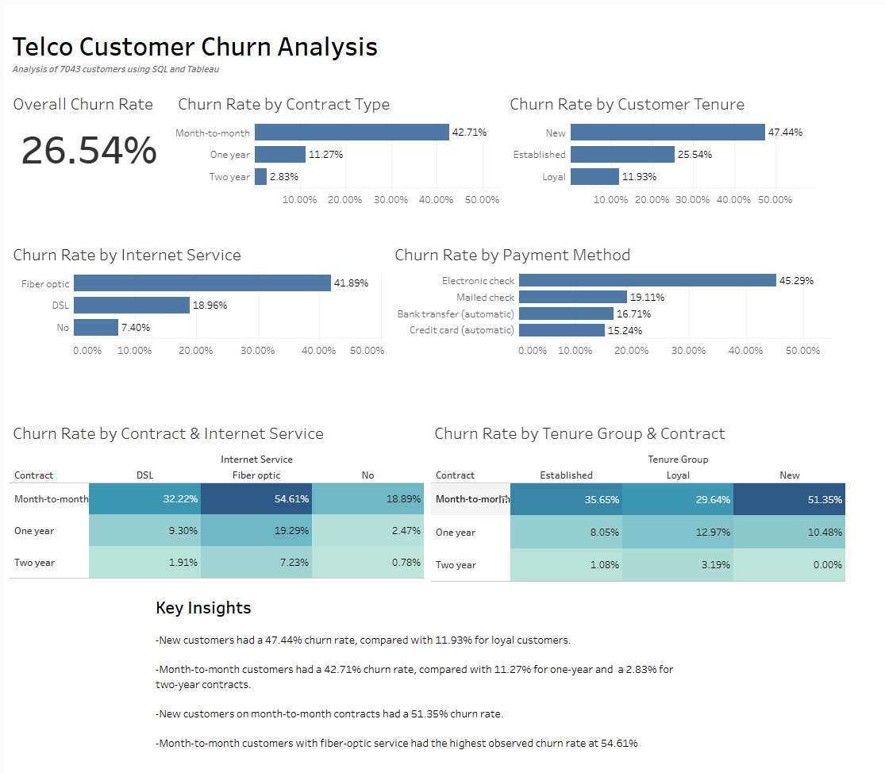

# Telco Customer Churn Analysis

## Project Overview

Customer churn is an important business problem because losing existing customers can reduce revenue and increase the need for customer acquisition.

In this project, I analyzed a dataset of 7,043 telecommunications customers to identify patterns associated with customer churn. I used SQL in Google BigQuery to analyze churn across customer characteristics such as contract type, tenure, internet service, payment method, and monthly charges.

I then used Tableau to create an interactive dashboard that summarizes the major churn patterns identified in the analysis.

## Tools Used

- SQL
- Google BigQuery
- Tableau
- GitHub

## Dataset

The dataset contains information for 7,043 telecommunications customers, including:

- Customer tenure
- Contract type
- Internet service
- Payment method
- Monthly charges
- Total charges
- Customer churn status

The overall customer churn rate in the dataset was **26.54%**.

## Analysis

I used SQL to examine churn across several customer segments. The analysis included:

1. Overall churn rate
2. Churn by contract type
3. Churn by internet service
4. Churn by payment method
5. Churn by monthly charges
6. Churn by customer tenure
7. Churn by contract type and internet service
8. Churn by tenure group and contract type
9. Creation of a final dataset for visualization

SQL techniques used in the analysis included:

- `COUNT()` and `COUNTIF()`
- `GROUP BY`
- `ORDER BY`
- `CASE WHEN`
- `CAST()`
- `HAVING`
- Aggregate calculations
- Customer segmentation

## Key Findings

- The overall churn rate was **26.54%**.
- New customers had a **47.44% churn rate**, compared with **11.93%** among loyal customers.
- Month-to-month customers had a **42.71% churn rate**, compared with **11.27%** for one-year contracts and **2.83%** for two-year contracts.
- New customers on month-to-month contracts had a **51.35% churn rate**.
- Month-to-month customers with fiber-optic internet had the highest observed churn rate at **54.61%**.

These results suggest that churn was particularly associated with shorter customer tenure and month-to-month contracts in this dataset.

## Tableau Dashboard

I created a Tableau dashboard to visualize the churn patterns identified through the SQL analysis.

[View the interactive Tableau dashboard]
(https://public.tableau.com/views/TelcoCustomerChurnAnalysis_17899302339570/Dashboard1?:language=en-US&:sid=&:redirect=auth&:display_count=n&:origin=viz_share_link)

### Dashboard Preview

The dashboard includes:

- Overall churn rate
- Churn by contract type
- Churn by customer tenure
- Churn by internet service
- Churn by payment method
- Contract and internet service churn heatmap
- Tenure and contract churn heatmap

## Business Recommendations

Based on the patterns observed in the analysis, a telecommunications company could investigate strategies such as:

- Improving onboarding and early customer engagement for new customers.
- Encouraging month-to-month customers to consider longer-term contracts through appropriate incentives.
- Investigating the customer experience of fiber-optic subscribers, particularly those on month-to-month contracts.
- Monitoring high-churn customer segments to identify opportunities for targeted retention efforts.

These recommendations are based on associations observed in the dataset and do not establish that these factors directly cause customer churn.

## Repository Structure

`sql/` contains the nine SQL queries used throughout the analysis.

The queries progress from overall churn measurement to customer segmentation and multi-variable analysis, ending with the dataset used for visualization.

## Skills Demonstrated

This project demonstrates experience with:

- SQL data analysis
- Data aggregation and segmentation
- Google BigQuery
- Tableau dashboard development
- Data visualization
- Identifying business insights from customer data
- Communicating analytical findings
